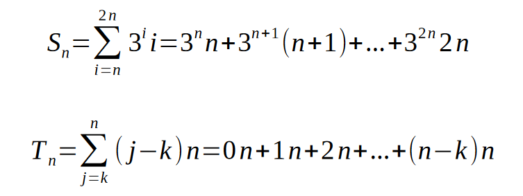
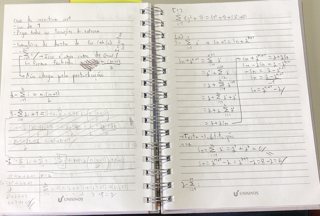

# Análise da Complexidade de Algoritmos Iterativos
Em alguns casos não é possível simplesmente fazer o método da contagem e esperar pelo melhor, volta e meia temos algoritmos que diferenciam seu tamanho dependendo da iteração, fator que gera somatórios.

Somatórios servem de implementações de *for loops* para situações onde a quantidade de iterações varia conforme a progressão da execução.
A explicação mais simples de como um somatório funciona é realmente um *for*. O valor de baixo é a variável declarada, acima é a condição de limite e sempre vai ser i++.
A notação do somatório pode ser um tanto complexa, veja: 

- somatório 
    - a quantidade de iterações dos laços internos mudam conforme o codigo roda 
## Somatórios
- Sigma maiúsculo
    - embaixo é origem
    - emcima é destino
- todo laço de repetição é um somatório (iteração)
    - recursividade é um somatório tbm
- x tem todos os valore iguais

### propriedades
- Associatividade
    - somatórios com intervalos iguais tem a mesma variável
    - a soma de somatórios é um somatório com soma dentro
- distributividade
    - constante multiplicando o valor alterado td iteração
    - joga isso pra fora do somatório q dá no mesmo
- comutatividade
    - ordem de soma do somatório n importa de verdade
- combinação
    - quando o término de um é o início do outro
    - menor início até o maior final
    - faz uma soma extra com a variável valendo o valor do meio (que "ligaria" os dois somatórios)
- separação
    - dá pra tirar um dos termos do somatório e somar por fora (dá no mesmo)
    - precisa cuidar o intervalo do somatório
- reindexação

### formas/fórmula fechadas
- não tem forma padrão de montar
    - pelo menos pros complexos
- único pra cada somatório
- *método da perturbação*
    - aplica todas as propriedades possíveis
- se encontra pra n+1 acha pra tds os anteriores
- normalmente
    - tira o primeiro do somatório (sai o n+1 extra)
    - readequa o índice na variável (i+1)
        - precisa disso aqui já que tirou a primeira e a última iteração
    - como agr tem uma soma +1 no exponencial, dá pra arrancar o x¹ fora e tratar ele como constante, jogando fora do somatório
    - pronto, somatório inicial, agr dá pra jogar
    - troca o somatório pro S_n e faz uma equação simples
- o objetivo é chegar no somatório original e tirar ele pelo S_n
- o teste é escolher valores de x e n e testar se os dois funcionam
    - troque por uns valore baixos
- simplificação n altera a resposta
- funciona pra casos mais simples

### exercícios
[2 ]

