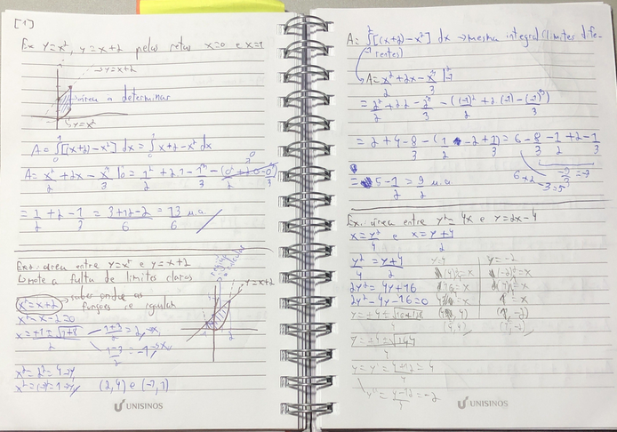
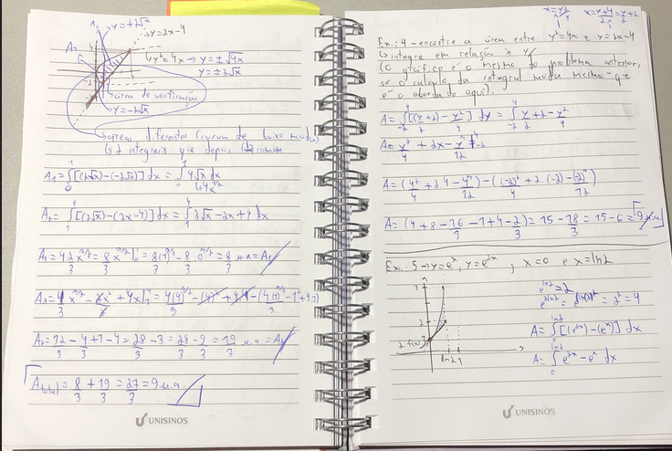

# Área entre curvas
É uma área que se encontra entre duas curvas em um determinado intervalo de espaço. 
Nesse caso não é necessário se preocupar com a relação delas ao eixo x, ele não entre nesse cálculo

- é literalmente a área entre duas curvas
- divide o intervalo em subintervalos
- a ideia inicial é igual a exaustão    
    - meter um monte de retângulo entre as curvas e somar todas as áreas
    - somatório da diferença da função de cima menos a de baixo
- da mesma forma, esse somatório vai virar uma integral definida
- precisamo de algum apoio gráfico pra saber qual função é a de cima e qual a de baixo
[1 ]
- em casos que não existem limites claros, os limites são pontos (os pontos de intersecção das duas curvas)
    - podem existir um ou mais
    - é preciso igualar as duas funções para saber seus limites (os pontos para o cálculo da integral)

### Exemplos

