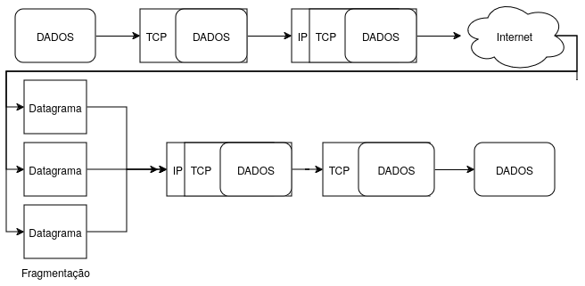

# IP - Internet Protocol
## 0. Resumo
Protocolo IP é o protocolo da camada de rede, sendo responsável por "carregar" todos os segmentos da camada de transporte. Exemplos são [TCP](Camada%20de%20Transporte/tcp.md), UDP e ICMP.

Por padrão é _connectionless_, ou seja, não é feita uma conexão para começar a _stream_, isso também significa que o protocolo não mantém ordem sobre os datagramas que são enviados o que pode ocasionar na chegada de datagramas mais novos antes dos mais antigos. Esses datagramas também podem ser roteados usando rotas diferentes.

O IP não é confiável e segue o modelo _best effort_ onde:
    + Datagramas podem ser perdidos
    + podem chegar fora de ordem
    + podem chegar corrompidos 
    + podem nem chegar

### Funcionamento Resumido:
 

--- 
## 1. Introdução
Podemos dizer que o protocolo IP é a cola que segura a Internet e que carrega uma grande parte dos protocolos do modelo TCP/IP. Diversos protocolos como o [TCP](Camada%20de%20Transporte/tcp.md), UDP e ICMP dependem de datagramas IPs para serem transmitidos. O protocolo, por padrão, é não confiável e entre datagramas de sem conexão.

Não confiável significa que não há garantia para que o datagrama chegue ao seu destino e que ele chegue na ordem correta. O protocolo IP  é baseado no best effort, onde os datagramas podem ser perdidos, podem chegar fora de ordem, podem chegar corrompidos ou até mesmo nem chegarem. Por padrão, o protocolo pode descartar datagramas e mandar mensagens ICMP para a origem avisando do erro, porém, para confiabilidade é necessário usar de protocolos nas camadas acima como o [TCP](Camada%20de%20Transporte/tcp.md).

Ele é _connectionless_, isso é, o IP não tem informações sobre séries de datagramas. Cada datagrama é independente, podendo ou não ser roteado por diferentes rotas.

### Como funciona: 
A camada de transporte pega uma _stream_ de dados e empacota em datagramas que podem chegar até 64 Kilobytes, porém, normalmente não ultrapassam 1500 bytes. Cada datagrama é transmitido pela internet e pode ou não ser fragmentado no caminho. Quando chega no host é remontado pela camada de rede no datagrama original e é enviado para camada de transporte.

$$ \dfrac{10}{10} = 1 $$ 

## Referências
* Tanenbaum, A; Feamster, N; Wheterall, D. Computer Networks. 6th ed. Hockham Way, Harlow, Reino Unido: Pearson Educational Limited, 2021.
* Tanenbaum, A. Computer Networks. 3rd ed. Upper Saddle River, New Jersey, EUA:Prentice Hall PTR, 1996.
* Stevens, W. Richard. TCP/IP Illustrated: the Protocols, vol 1. 1st ed. Reading, MA, EU: Addison-Wesley Publishing Company, 1994.

